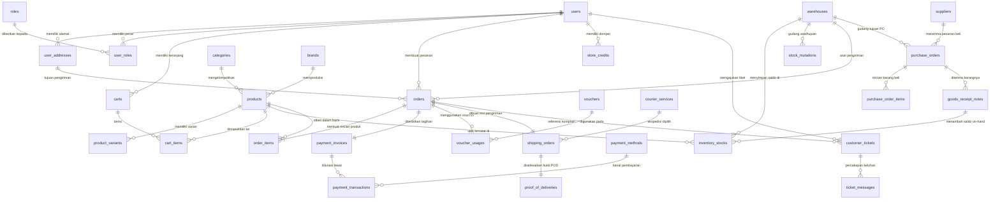

# 🏪 PT Nusantara SuperMart Indonesia — Microservices Monorepo (Kelompok 05)

> **Repositori Proyek Microservices SuperMart — Kelompok 05**  
> Proyek ritel dan rantai pasok (*supply chain*) *omnichannel* berskala enterprise untuk mata kuliah Microservices. Berkas ini berisi dokumentasi sistem, panduan dekomposisi monolitik, serta petunjuk setup database per domain layanan (*Database-per-Service*).

---

## 📋 Daftar Isi

1. [Struktur Monorepo & Database per Domain](#-struktur-monorepo--database-per-domain)
2. [Latar Belakang & Tujuan Pembelajaran](#-latar-belakang--tujuan-pembelajaran)
3. [Arsitektur Sistem Eksisting (Monolitik)](#-arsitektur-sistem-eksisting-monolitik)
4. [Arsitektur Relasional Basis Data (120 Tabel & 9 Kluster)](#-arsitektur-relasional-basis-data-120-tabel--9-kluster)
5. [Diagram Alur & Relasi Antar-Entitas (ERD Flow)](#-diagram-alur--relasi-antar-entitas-erd-flow)
6. [Fungsionalitas Lengkap Aplikasi per Peran Pengguna](#-fungsionalitas-lengkap-aplikasi-per-peran-pengguna)
7. [Titik Kopling Monolitik (Target Dekomposisi Mahasiswa)](#-titik-kopling-monolitik-target-dekomposisi-mahasiswa)
8. [Daftar Akun Demo & Kredensial Pengujian](#-daftar-akun-demo--kredensial-pengujian)
9. [Panduan Menjalankan Lingkungan Database (Docker Compose)](#-panduan-menjalankan-lingkungan-database-docker-compose)
10. [Panduan Menjalankan Aplikasi Monolith (Bare-Metal Local Development)](#-panduan-menjalankan-aplikasi-monolith-bare-metal-local-development)
11. [Katalog Endpoint REST API Utama](#-katalog-endpoint-rest-api-utama)
12. [Panduan Praktikum & Roadmap Tugas Mahasiswa](#-panduan-praktikum--roadmap-tugas-mahasiswa)
13. [Troubleshooting & Solusi Masalah Umum](#-troubleshooting--solusi-masalah-umum)

---

## 📁 Struktur Monorepo & Database per Domain

```
microservices-supermart-kelompok05/
├── deployments/
│   └── docker/
│       ├── docker-compose.yml          ← Orkestrasi database multi-service (Identity, Catalog, Inventory, Order)
│       └── init-scripts/
│           ├── identity/               ← Skrip DDL & DML Identity Service (PostgreSQL 15)
│           ├── catalog/                ← Skrip inisialisasi & seed Catalog Service (MongoDB 6.0)
│           ├── inventory/              ← Skrip DDL & DML Inventory Service
│           └── order/                  ← Skrip DDL & DML Order Service
├── services/                           ← Source code microservices
│   ├── identity-service/
│   ├── catalog-service/
│   ├── inventory-service/
│   └── order-service/
├── docs/
│   └── architecture-decisions.md       ← Dokumentasi keputusan arsitektur (ADR)
└── README.md                           ← Dokumentasi petunjuk & setup
```

---

## 🗄️ Spesifikasi Database per Layanan (Docker Compose)

| Domain Service | Teknologi DBMS | Port Host | Port Container | Database Name | User / Auth |
| :--- | :--- | :---: | :---: | :--- | :--- |
| **Identity** | PostgreSQL 15 | `5431` | `5432` | `identity_service_db` | `identity_admin` / `identity_secret_pass` |
| **Catalog** | MongoDB 6.0 | `27017` | `27017` | `catalog_service_db` | `catalog_admin` / `catalog_secret_pass` |
| **Inventory** | PostgreSQL 16 | `5433` | `5432` | `inventory_db` | `inventory_user` / `inventory_secret` |
| **Order** | PostgreSQL 16 | `5434` | `5432` | `order_db` | `order_user` / `order_secret` |

---

## 🚀 Panduan Menjalankan Lingkungan Database (Docker Compose)

### Prasyarat
- [Docker Desktop](https://www.docker.com/products/docker-desktop/) (v24+)
- [Git](https://git-scm.com/)

### 1. Menjalankan Database

Masuk ke direktori `deployments/docker`:
```bash
cd deployments/docker
docker compose up -d
```

### 2. Memeriksa Status Kontainer & Logs
```bash
# Cek status seluruh kontainer
docker compose ps

# Cek logs kontainer tertentu (contoh: identity-db)
docker compose logs -f identity-db
```

### 3. Menghentikan Kontainer Database
```bash
# Hentikan kontainer tanpa menghapus data
docker compose down

# Hentikan dan hapus volume persistent (reset data)
docker compose down -v
```

---

## 🎓 Latar Belakang & Tujuan Pembelajaran

Di industri perangkat lunak modern, arsitektur *microservices* jarang dibangun langsung dari nol (*greenfield*). Kebanyakan organisasi memulai dengan sistem **monolitik**, kemudian secara bertahap memecahnya (*decomposition*) seiring pertumbuhan organisasi, skala transaksi, dan kompleksitas domain bisnis.

Proyek ini menghadirkan sistem monolitik ritel enterprise yang utuh dan berjalan nyata:
- **Basis Data Tunggal (`nusantara_db`)**: 120 tabel relasional yang saling terhubung melayani 9 kluster bisnis.
- **Backend Monolitik (Go 1.26 + Fiber v3)**: Satu *binary* terpadu dengan 9 paket domain internal yang memiliki titik kopling (*in-process coupling*) sinkron yang sengaja disematkan untuk dipecah.
- **Frontend SPA Terpadu (Angular 22)**: Antarmuka modern dengan *Signals*, *Standalone Components*, *Role-Based Routing*, dan portal interaktif untuk Pelanggan, Staf Gudang, Kurir, Agen CS, dan Super Admin.
- **Infrastruktur Docker Compose**: Otomasi lingkungan pengembangan lokal berbasis kontainer.

---

## 🏛️ Arsitektur Sistem Eksisting (Monolitik)

```
                                  ┌─────────────────────────────────────────┐
                                  │             Angular 22 SPA              │
                                  │   (Pelanggan, Gudang, Kurir, CS, Admin) │
                                  └────────────────────┬────────────────────┘
                                                       │ HTTP REST (Port 4200 / 80)
                                                       ▼
                                  ┌─────────────────────────────────────────┐
                                  │          Nginx Reverse Proxy            │
                                  │        (/ -> SPA, /api -> Backend)      │
                                  └────────────────────┬────────────────────┘
                                                       │ Proxy Pass
                                                       ▼
                                  ┌─────────────────────────────────────────┐
                                  │          Go Fiber v3 Monolith           │
                                  │           (HTTP Port 3000)              │
┌─────────────────────────────────┴─────────────────────────────────────────┴─────────────────────────────────┐
│                                       9 PAKET DOMAIN INTERNAL                                              │
│ 1. auth         │ 2. catalog      │ 3. inventory    │ 4. order        │ 5. payment       │ 6. promotion    │
│    Akun & RBAC  │    Produk & SKU │    Stok & Hub   │    Cart & Order │    Invoice & Pay │    Voucher & Poin│
│─────────────────┼─────────────────┼─────────────────┼─────────────────┼──────────────────┼─────────────────│
│ 7. logistics    │ 8. procurement  │ 9. support      │                 │                  │                 │
│    Kurir & POD  │    PO & GRN     │    Tiket & Chat │                 │                  │                 │
└─────────────────────────────────┬─────────────────────────────────────────┬─────────────────────────────────┘
                                  │                                         │
                                  │ SQLX Connection Pool (Port 3306)        │
                                  ▼                                         ▼
                                  ┌─────────────────────────────────────────┐
                                  │               MySQL 8.0                 │
                                  │      (Basis Data 120 Tabel Fisik)       │
                                  └─────────────────────────────────────────┘
```

---

## 🗄️ Arsitektur Relasional Basis Data (120 Tabel & 9 Kluster)

Basis data `nusantara_db` dirancang dengan integritas relasional tinggi (*ACID Compliance* melalui *InnoDB Engine*). Ke-120 tabel dibagi ke dalam 9 kluster fungsional:

| # | Kluster Bisnis | Jumlah Tabel | Entitas Kunci / Tabel Utama | Ketergantungan Relasional Antar-Kluster |
|---|---|:---:|---|---|
| **1** | **Identitas, Akun, & RBAC** | 12 | `users`, `user_profiles`, `user_addresses`, `user_kyc_documents`, `roles`, `permissions`, `user_roles`, `role_permissions`, `auth_tokens`, `login_histories` | Menjadi referensi `user_id` bagi seluruh transaksi (Order, Tiket, Audit Gudang, Kurir, Profil). |
| **2** | **Katalog Produk & Merek** | 16 | `products`, `categories`, `brands`, `product_variants`, `product_images`, `product_attributes`, `product_reviews`, `tags` | Menjadi master data produk yang direferensikan oleh Order Items, Inventory Stocks, PO Items, Flash Sale. |
| **3** | **Inventaris & Multi-Gudang** | 15 | `warehouses`, `warehouse_zones`, `warehouse_shelves`, `inventory_stocks`, `stock_mutations`, `stock_reservations`, `stock_opnames`, `low_stock_alerts` | Mengikat `products` ke fasilitas `warehouses`. Berelasi logis ke `orders` untuk pemesanan/reservasi stok. |
| **4** | **Pemesanan & Transaksi Penjualan** | 18 | `orders`, `order_items`, `order_statuses`, `carts`, `cart_items`, `order_shipping_details`, `order_status_histories`, `order_discounts` | Pusat transaksi: menghubungkan `users`, `user_addresses`, `warehouses`, dan `products`. |
| **5** | **Pembayaran & Finansial** | 12 | `payment_invoices`, `payment_methods`, `payment_transactions`, `store_credits`, `credit_transactions`, `refunds`, `escrow_accounts` | Berelasi langsung dengan `orders` (1:1 untuk tagihan faktur) dan `users` (dompet kredit/refund). |
| **6** | **Promosi, Voucher, & Loyalitas** | 14 | `promotions`, `vouchers`, `voucher_usages`, `loyalty_points`, `point_transactions`, `point_redemptions`, `flash_sales` | Menghubungkan `vouchers` ke `orders` dan `users` saat pemotongan diskon transaksi. |
| **7** | **Logistik, Armada, & Kurir** | 13 | `courier_partners`, `courier_services`, `shipping_rates`, `vehicle_fleets`, `courier_drivers`, `shipping_orders`, `proof_of_deliveries` | Mengikat `orders` ke proses serah terima fisik kurir dan pencatatan nomor resi pelacakan. |
| **8** | **Pengadaan (Procurement) & Vendor** | 10 | `suppliers`, `supplier_contacts`, `purchase_orders`, `purchase_order_items`, `goods_receipt_notes`, `goods_receipt_items`, `purchase_invoices` | Menghubungkan `suppliers` ke `warehouses` dan `products` untuk pengisian ulang stok barang masuk. |
| **9** | **Layanan Pelanggan & Bantuan** | 10 | `customer_tickets`, `ticket_categories`, `ticket_messages`, `ticket_assignments`, `disputes`, `faq_articles` | Menghubungkan pelanggan (`users`), pesanan (`orders`), dan staf penanganan kendala (`agents`). |

---

## 📊 Diagram Alur & Relasi Antar-Entitas (ERD Flow)



---

## 📱 Fungsionalitas Lengkap Aplikasi per Peran Pengguna

### 1. 🛍️ Portal Pelanggan (Customer)
- **Katalog & Navigasi**: Penelusuran produk retail dengan pencarian instan, filter kategori, filter merek, dan pengurutan harga/populer.
- **Keranjang Belanja (Cart)**: Pengaturan kuantitas barang, penambahan catatan khusus per item, estimasi subtotal, dan validasi kode voucher.
- **Checkout Multi-Alamat & Hub Gudang**: Pemilihan alamat pengiriman, pemilihan gudang pemenuhan (Jakarta, Surabaya, Denpasar Hub), dan jenis kurir.
- **Pesanan Saya (Order History)**: Daftar pesanan dengan *status badges*, nomor resi pengiriman, serta simulator pembayaran instan.
- **Dompet Toko & Poin Loyalitas**: Saldo dompet digital, riwayat transaksi kredit/debit, top-up saldo, dan penukaran poin reward.
- **Pusat Bantuan & FAQ**: Pangkalan pengetahuan mandiri, pengajuan tiket keluhan terhubung ke pesanan, dan obrolan dengan CS.

### 2. 🏭 Portal Staf Gudang (Warehouse Staff)
- **Manajemen Stok Regional**: Pemantauan inventaris fisik real-time pada setiap cabang gudang (Jakarta, Surabaya, Denpasar).
- **Penyesuaian Stok (Opname)**: Pembaruan saldo fisik aktual dan pencatatan alasan audit.
- **Peringatan Stok Menipis**: Peringatan otomatis produk di bawah ambang batas minimum (*reorder threshold*).
- **Mutasi Stok Antar-Gudang**: Transfer persediaan antar-gudang untuk pemerataan stok regional.
- **Penerimaan Barang Masuk (GRN)**: Verifikasi penerimaan kiriman dari pemasok berdasarkan Purchase Order (PO).

### 3. 🚚 Portal Kurir & Armada (Courier)
- **Daftar Penugasan Pengiriman**: Antrean pengiriman dengan nomor resi, berat paket, dan alamat penerima.
- **Pembaruan Status Pengiriman**: Mengubah status paket menjadi `PICKED_UP` dan `IN_TRANSIT`.
- **Penyelesaian Bukti Pengiriman (POD)**: Konfirmasi serah terima paket yang mencatat nama penerima, foto dokumentasi, dan catatan kurir.

### 4. 🎧 Portal Agen Bantuan (Customer Service Agent)
- **Antrean Tiket Terpadu**: Monitoring tiket keluhan pelanggan berdasarkan skala prioritas dan status.
- **Disposisi Penugasan**: Klaim atau delegasi penugasan tiket bantuan.
- **Thread Percakapan Interaktif**: Obrolan dua arah dengan pelanggan secara real-time.
- **Resolusi Masalah**: Penyelesaian tiket komplain pelanggan.

### 5. ⚙️ Konsol Super Administrator (Super Admin)
- **Dashboard Eksekutif**: Ringkasan indikator kinerja utama (Total Transaksi, Pendapatan Kotor, Item Kritis, Tiket Terbuka).
- **Manajemen Pengguna & Otorisasi**: Kelola akun terdaftar, status keaktifan, dan pembagian peran hak akses (RBAC).
- **Verifikasi Identitas Legal (KYC Approval)**: Verifikasi dokumen identitas resmi (KTP/NIK) pelanggan.
- **Master Katalog Produk**: Pengelolaan SKU produk baru, penetapan harga dasar, kategori, dan merek.
- **Promosi & Voucher**: Pembuatan kode voucher belanja baru dan kampanye pemasaran.

---

## 🔗 Titik Kopling Monolitik (Target Dekomposisi Mahasiswa)

```
[ Checkout / Order Service ]
       │
       ├──(Kopling 1: Langsung panggil katalog)──► catalog.Service.GetProductByID()
       │
       └──(Kopling 2: Langsung panggil gudang)───► inventory.Service.ReserveStock()

[ Payment Service ]
       │
       └──(Kopling 3: Pelunasan langsung ubah order)──► order.Service.UpdateStatus("PAID")

[ Logistics Service ]
       │
       └──(Kopling 4: POD kurir langsung selesaikan order)──► order.Service.UpdateStatus("DELIVERED")

[ Procurement Service ]
       │
       └──(Kopling 5: Penerimaan GRN langsung mutasi stok)──► UPDATE inventory_stocks SET quantity_on_hand += ...
```

---

## 👥 Daftar Akun Demo & Kredensial Pengujian

Semua akun pra-konfigurasi dalam `seed.sql` menggunakan kata sandi: **`password123`**

| Peran (Role) | Alamat Email | Kata Sandi | Portal Akses |
|---|---|---|---|
| **Super Admin** | `admin@nusantara-supermart.co.id` | `password123` | Dashboard Admin, Verifikasi KYC, Kelola Pengguna, Katalog, Promo |
| **Staf Gudang Jakarta** | `budi.gudang@nusantara-supermart.co.id` | `password123` | Stok Jakarta Hub, Opname, Mutasi, Terima GRN |
| **Staf Gudang Surabaya** | `eko.gudang@nusantara-supermart.co.id` | `password123` | Stok Surabaya Hub, Mutasi, Terima GRN |
| **Kurir Jakarta** | `kurir.jkt@nusantara-supermart.co.id` | `password123` | Antrean Kiriman Jakarta, In-Transit, Bukti POD |
| **Kurir Surabaya** | `kurir.sby@nusantara-supermart.co.id` | `password123` | Antrean Kiriman Surabaya, In-Transit, Bukti POD |
| **Agen CS** | `siti.cs@nusantara-supermart.co.id` | `password123` | Antrean Tiket Bantuan, Chat Pelanggan |
| **Pelanggan (Siti)** | `siti.aminah@gmail.com` | `password123` | Belanja Katalog, Keranjang, Checkout, Bayar, Dompet |
| **Pelanggan (Budi)** | `budi.santoso@yahoo.com` | `password123` | Belanja Katalog, Voucher Promo, Pesanan, Tiket Bantuan |

---

## 💻 Panduan Menjalankan Aplikasi Monolith (Bare-Metal Local Development)

Gunakan metode ini jika Anda ingin menjalankan backend Go dan frontend Angular bawaan seed project.

### 1. Persiapan Basis Data MySQL Bawaan Seed
```bash
docker run -d --name mysql-supermart -p 3306:3306 \
  -e MYSQL_ROOT_PASSWORD=root_secret \
  -e MYSQL_DATABASE=nusantara_db \
  -e MYSQL_USER=nusantara_user \
  -e MYSQL_PASSWORD=nusantara_secret \
  mysql:8.0 --default-authentication-plugin=mysql_native_password

# Tunggu hingga MySQL siap, lalu inisialisasi:
./scripts/init-db.sh
```

### 2. Menjalankan Backend (Go Monolith)
```bash
cd backend
cp ../.env.example .env
go mod tidy
go run main.go
```
*Backend berjalan di: `http://localhost:3000`*

### 3. Menjalankan Frontend (Angular 22 SPA)
```bash
cd frontend
npm install
npm start
```
*Frontend dapat diakses di: `http://localhost:4200`*

---

## 📡 Katalog Endpoint REST API Utama

Backend menyajikan endpoint RESTful terstandarisasi di bawah rute `/api/v1`:
- **`/api/v1/auth`**: Login, register, me, addresses, users, KYC verification.
- **`/api/v1/catalog`**: Products list/detail, categories, brands, admin product management.
- **`/api/v1/inventory`**: Warehouses, stocks, stock adjustments, low-stock alerts, mutations.
- **`/api/v1/order`**: Cart, cart items, checkout, order history & detail, cancel order.
- **`/api/v1/payment`**: Invoices, invoice payment, wallet balance, top-up.
- **`/api/v1/promotions`**: Vouchers, voucher validation, loyalty points, point redemption.
- **`/api/v1/logistics`**: Shipments, shipment status update, proof of delivery (POD).
- **`/api/v1/procurement`**: Purchase orders (PO), PO approval, goods receipt notes (GRN).
- **`/api/v1/support`**: FAQ, support tickets, ticket messages, ticket assignment & status.

---

## 🗺️ Panduan Praktikum & Roadmap Tugas Mahasiswa

- **🎯 Milestone 1**: Domain-Driven Design (DDD) & Pemisahan Bounded Context.
- **🎯 Milestone 2**: Ekstraksi Layanan Microservice Pertama (*Database-per-Service*).
- **🎯 Milestone 3**: Komunikasi Asinkron & Saga Pattern pada Alur Transaksi.
- **🎯 Milestone 4**: Kontainerisasi, Observabilitas, & Service Mesh.

---

## 🔧 Troubleshooting & Solusi Masalah Umum

1. **Port Bentrok (*Address already in use*)**: Pastikan tidak ada service lokal lain yang menggunakan port 5431, 27017, 3306, atau 3000.
2. **Koneksi Database Gagal**: Periksa status kontainer dengan `docker compose ps` dan pastikan kredensial pada `.env` sudah sesuai tabel database per domain.
3. **Reset Data Bersih**: Jalankan `docker compose down -v` lalu `docker compose up -d` untuk memuat ulang skrip DDL/DML dari awal.

---

## 📄 Dokumentasi Tambahan

- [Architecture Decisions Record (ADR)](docs/architecture-decisions.md) – Keputusan pemilihan DBMS dan arsitektur Polyglot Persistence.
